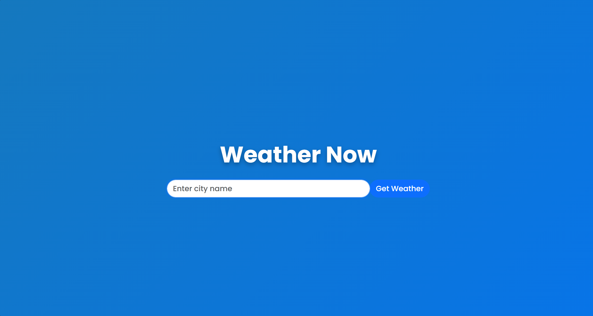

# Weather-App

A sleek and responsive weather app that allows users to check the weather for any city. The app uses the OpenWeatherMap API to fetch weather data and displays it in an intuitive and stylish interface, with animated backgrounds and elegant weather cards for a modern user experience.

## Features

- **Search for Weather**: Users can input any city name and get the current weather information.
- **Multiple Weather Icons**: Depending on the weather condition, different icons are displayed (e.g., sun, rain, clouds).
- **Stylish UI**: Uses Bootstrap for responsive design, FontAwesome for icons, and custom animations and backgrounds for a visually appealing layout.
- **Glassmorphism**: Weather cards feature a glass-like effect for a modern look.
  
## Technologies Used

- **HTML**: Provides the structure of the web application.
- **CSS**: Styles the app, including custom animations and backgrounds.
- **JavaScript**: Handles the logic for fetching weather data and updating the DOM.
- **Bootstrap**: Makes the app responsive and modern with minimal effort.
- **FontAwesome**: Provides icons for different weather conditions.
- **OpenWeatherMap API**: Fetches real-time weather data based on user input.

## Screenshots

Here is how the  Weather App looks:

